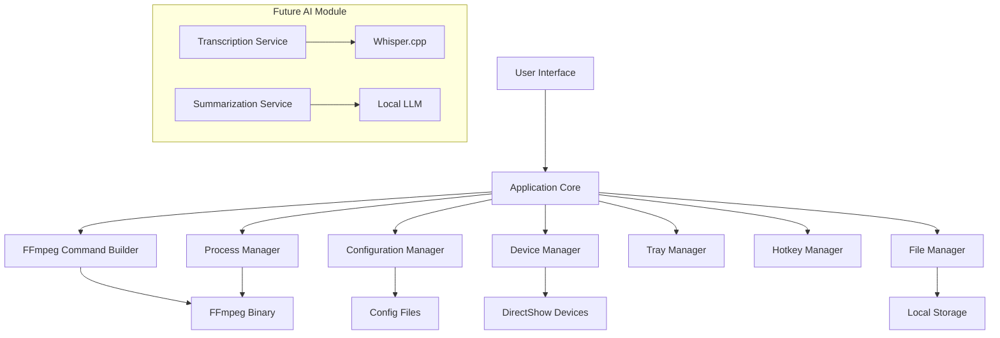
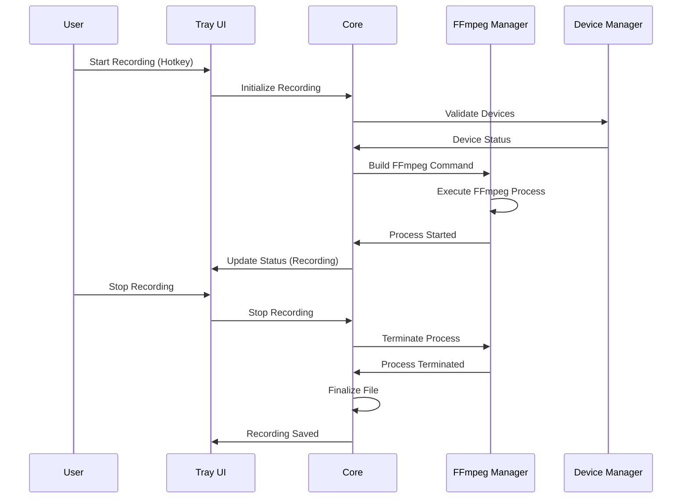
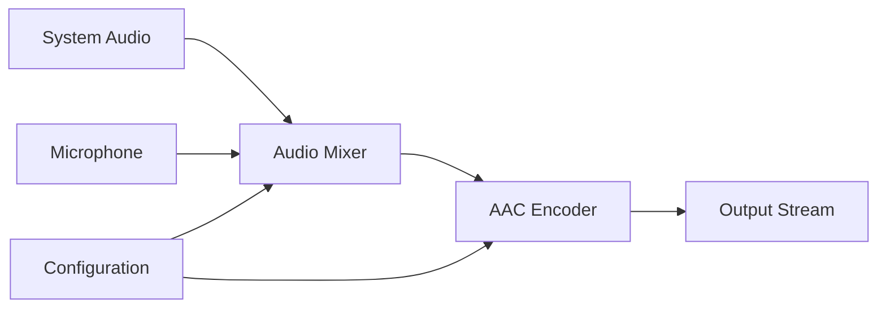
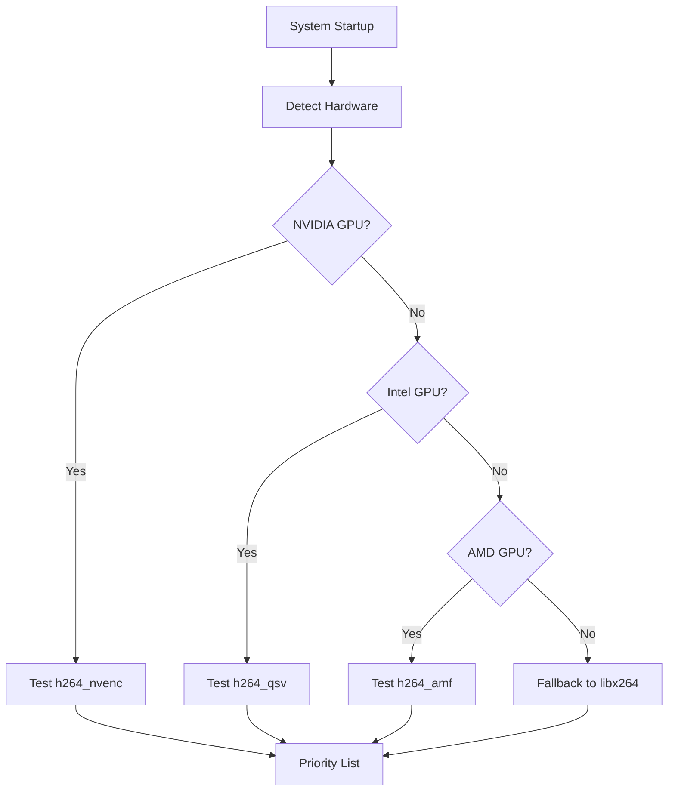
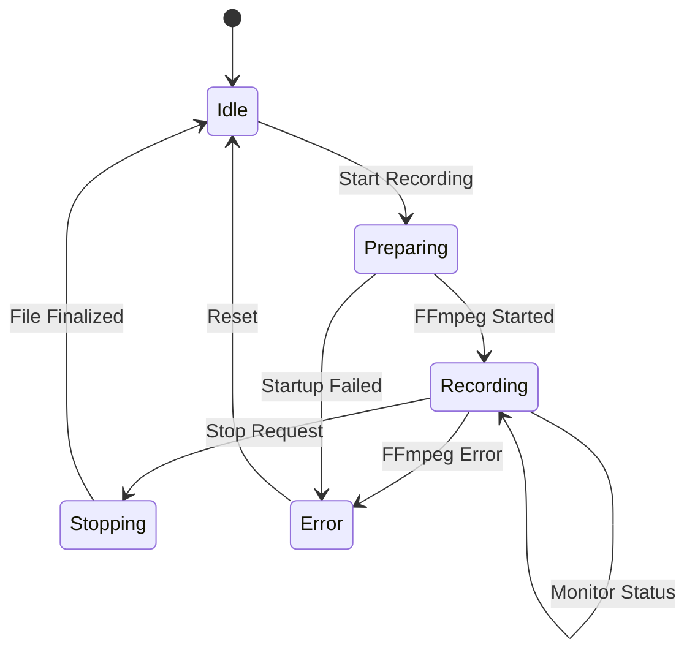
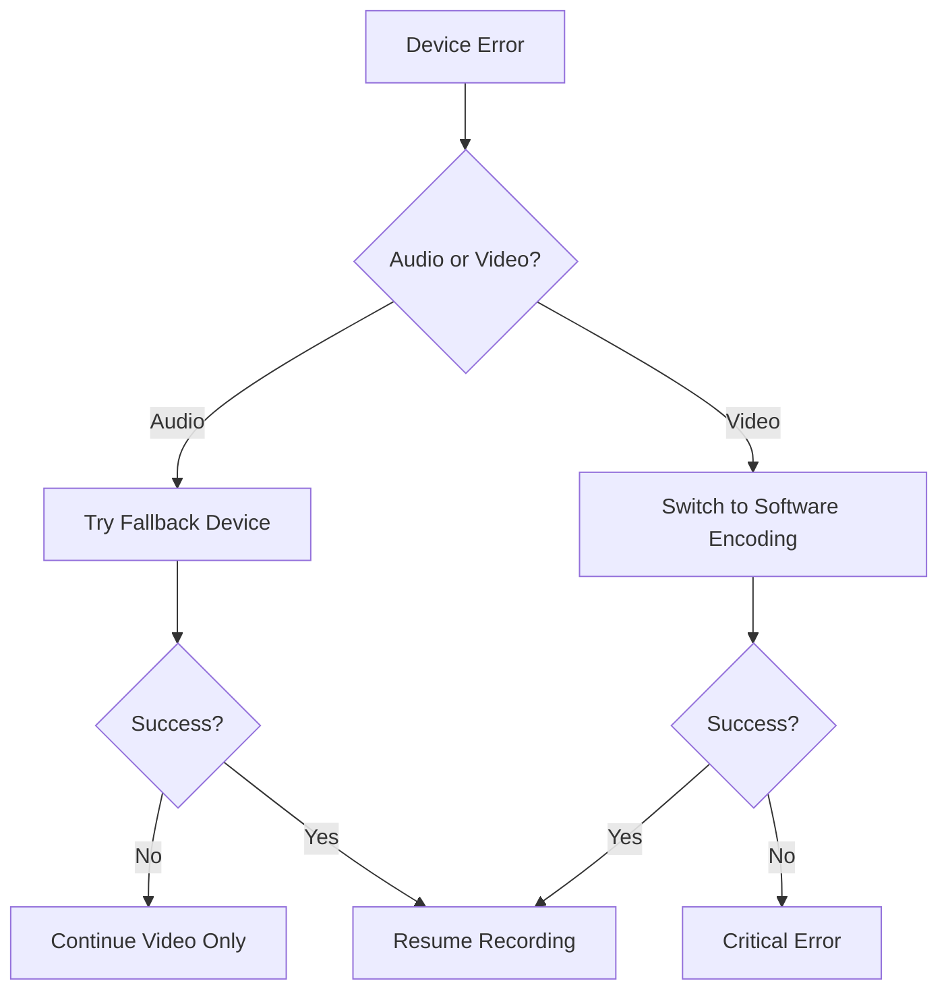
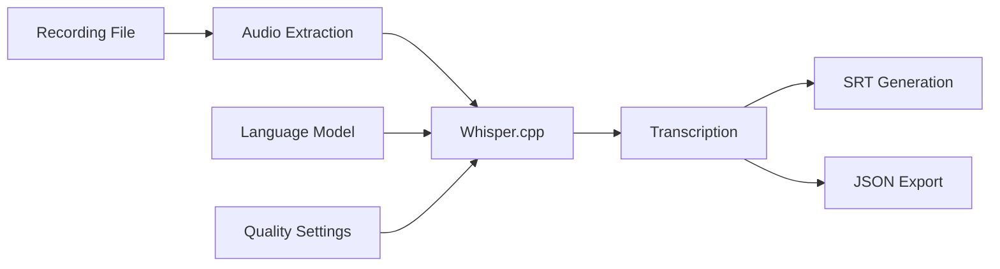
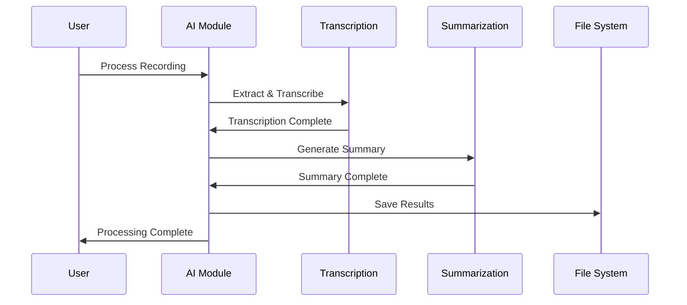
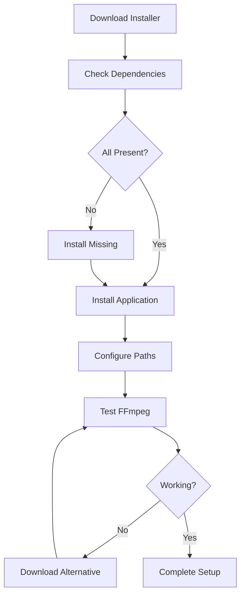

# Sideo - Screen Recording Application Design

## Overview

Sideo is an open-source, free screen and audio recording application for Windows 11. The application operates entirely offline, providing silent recording capabilities that remain undetected during video calls. It serves as an optimized wrapper around FFmpeg, designed for lightweight operation on low-end hardware while maintaining professional recording quality.

### Core Objectives
- **Offline Operation**: No internet connectivity required
- **Silent Recording**: Undetectable during video calls
- **Local Storage**: All recordings saved to configurable local paths
- **Performance Optimized**: Designed for low-resource systems
- **Reliability First**: MKV default format with optional MP4 post-processing

## Technology Stack

### Core Technologies
- **Backend Framework**: Electron with Node.js
- **UI Framework**: React with TypeScript
- **Video Processing**: FFmpeg (external binary)
- **Audio Processing**: FFmpeg DirectShow (dshow)
- **Configuration**: JSON-based configuration management
- **Package Manager**: npm/yarn

### Alternative Technology Considerations

#### Option 1: Native Desktop (Recommended for Performance)
- **Language**: C++ with Qt6 or C# with WPF/.NET 6
- **Advantages**: Lower memory footprint, better performance
- **Disadvantages**: More complex development

#### Option 2: Cross-platform (Current Choice)
- **Language**: Electron + TypeScript
- **Advantages**: Rapid development, familiar web technologies
- **Disadvantages**: Higher memory usage

#### Option 3: Lightweight Native
- **Language**: Rust with Tauri
- **Advantages**: Memory efficient, secure
- **Disadvantages**: Steeper learning curve

## Architecture

### System Architecture



### Component Architecture

#### 1. Application Core
- **State Management**: Centralized recording state
- **Event Coordination**: Inter-component communication
- **Safety Controls**: Disk space monitoring, duration limits

#### 2. FFmpeg Integration Layer
- **Command Builder**: Dynamic FFmpeg command generation
- **Process Manager**: FFmpeg process lifecycle management
- **Output Parser**: Real-time stderr/stdout processing

#### 3. Device Management
- **Audio Device Discovery**: DirectShow device enumeration
- **Capability Detection**: Hardware encoder availability
- **Fallback Systems**: CPU encoding when hardware unavailable

#### 4. User Interface Components
- **Tray Interface**: Minimal system tray interaction
- **Settings Window**: Comprehensive configuration panel
- **Status Indicators**: Recording state visualization

## Core Features Architecture

### Recording Pipeline



### Quality Profiles System

#### Profile Structure
```json
{
  "profiles": {
    "low": {
      "name": "Low Quality (Weak PCs)",
      "video": {
        "resolution": "1280x720",
        "fps": 24,
        "bitrate_kbps": 4000,
        "encoder_priority": ["h264_nvenc", "h264_qsv", "libx264"]
      },
      "audio": {
        "bitrate_kbps": 128,
        "codec": "aac"
      }
    },
    "medium": {
      "name": "Medium Quality (Recommended)",
      "video": {
        "resolution": "1920x1080",
        "fps": 30,
        "bitrate_kbps": 8000,
        "encoder_priority": ["h264_nvenc", "h264_qsv", "h264_amf", "libx264"]
      },
      "audio": {
        "bitrate_kbps": 160,
        "codec": "aac"
      }
    },
    "high": {
      "name": "High Quality",
      "video": {
        "resolution": "1920x1080",
        "fps": 60,
        "bitrate_kbps": 12000,
        "encoder_priority": ["h264_nvenc", "h264_qsv", "h264_amf", "libx264"]
      },
      "audio": {
        "bitrate_kbps": 192,
        "codec": "aac"
      }
    }
  }
}
```

### Audio System Architecture

#### Audio Source Configuration
| Source Type | DirectShow Device | Use Case |
|-------------|------------------|----------|
| System Audio | Stereo Mix | Desktop sound capture |
| Microphone | USB/Built-in Mic | Voice recording |
| Mixed Audio | System + Mic | Commentary with desktop |

#### Audio Processing Pipeline


### Video Capture System

#### Screen Capture Sources
- **Primary Display**: Full desktop capture via gdigrab
- **Secondary Display**: Offset-based capture
- **Region Capture**: Custom area selection
- **Window Capture**: Specific application window

#### Hardware Encoder Detection


## Data Models

### Configuration Schema

#### Main Configuration
```typescript
interface AppConfig {
  output: {
    folder: string;
    container: 'mkv' | 'mp4';
    filename_template: string;
    segment_enabled: boolean;
    segment_minutes: number;
  };
  video: {
    source: 'desktop' | 'region' | 'window';
    region?: {
      offset_x: number;
      offset_y: number;
      width: number;
      height: number;
      enabled: boolean;
    };
    fps: number;
    encoder_priority: string[];
    bitrate_kbps: number;
    maxrate_kbps: number;
    bufsize_kbps: number;
    draw_mouse: boolean;
  };
  audio: {
    system_device: string;
    mic_device: string;
    mix_mic_with_system: boolean;
    aac_bitrate_kbps: number;
  };
  ui: {
    hotkey_start_stop: string;
    show_notifications: boolean;
    minimize_to_tray_on_start: boolean;
  };
  safety: {
    min_free_space_mb: number;
    prevent_sleep_while_recording: boolean;
    max_duration_minutes: number;
  };
  advanced: {
    ffmpeg_path: string;
    stderr_log_level: 'error' | 'warning' | 'info' | 'debug';
  };
}
```

#### Recording Session Model
```typescript
interface RecordingSession {
  id: string;
  start_time: Date;
  end_time?: Date;
  profile: string;
  output_path: string;
  status: 'recording' | 'stopped' | 'error';
  file_size_bytes?: number;
  duration_seconds?: number;
  error_message?: string;
}
```

#### Device Model
```typescript
interface AudioDevice {
  id: string;
  name: string;
  type: 'input' | 'output';
  is_default: boolean;
  is_available: boolean;
}

interface VideoCapability {
  encoder: string;
  hardware_accelerated: boolean;
  max_resolution: string;
  supported_formats: string[];
}
```

## Business Logic Layer

### Recording Management Service

#### Core Recording Operations


#### Safety and Monitoring
- **Disk Space Monitoring**: Real-time free space checking
- **Duration Limits**: Automatic stop at configured limits
- **Process Health**: FFmpeg process monitoring and recovery
- **File Integrity**: Proper file finalization on unexpected stops

### Configuration Management Service

#### Configuration Hierarchy
1. **Default Configuration**: Built-in safe defaults
2. **User Configuration**: Saved preferences
3. **Session Overrides**: Temporary runtime changes
4. **Profile-Specific**: Quality profile settings

#### Device Management Service
- **Device Discovery**: Periodic audio device enumeration
- **Capability Testing**: Hardware encoder validation
- **Fallback Logic**: Automatic degradation on failures

## User Interface Design

### System Tray Interface

#### Tray Menu Structure
```
┌─ Sideo ─────────────────┐
├─ ● Start Recording      │
├─ ■ Stop Recording       │
├─ ─────────────────────  │
├─ Profile: Medium ▸      │
├─ ─────────────────────  │
├─ Open Settings          │
├─ Open Recordings Folder │
├─ ─────────────────────  │
└─ Exit                   │
```

#### Status Indicators
- **Idle**: Gray icon, "Ready to record"
- **Recording**: Red icon, duration timer
- **Error**: Yellow icon, error indication

### Settings Window

#### Tab Structure
1. **General**: Output folder, file naming, hotkeys
2. **Video**: Quality, encoder selection, region capture
3. **Audio**: Device selection, mixing, quality
4. **Profiles**: Quality preset management
5. **Advanced**: FFmpeg path, logging, safety limits

### Notification System
- **Recording Started**: Toast notification with settings summary
- **Recording Stopped**: File saved location and duration
- **Errors**: Clear error messages with suggested actions
- **Warnings**: Disk space, performance issues

## FFmpeg Command Generation

### Command Building Strategy

#### Basic Screen + Audio Recording
```bash
ffmpeg
  -f gdigrab -framerate 30 -draw_mouse 1 -i desktop
  -f dshow -i audio="Stereo Mix (Device Name)"
  -c:v h264_nvenc -b:v 8M -maxrate 8M -bufsize 16M
  -c:a aac -b:a 160k
  "output.mkv"
```

#### Mixed Audio Sources
```bash
ffmpeg
  -f gdigrab -framerate 30 -i desktop
  -f dshow -i audio="Stereo Mix (Device Name)"
  -f dshow -i audio="Microphone (Device Name)"
  -filter_complex "[1:a][2:a]amix=inputs=2:duration=longest:dropout_transition=2[aout]"
  -map 0:v -map "[aout]"
  -c:v h264_nvenc -b:v 8M -maxrate 8M -bufsize 16M
  -c:a aac -b:a 160k
  "output.mkv"
```

#### Segmented Recording
```bash
ffmpeg
  -f gdigrab -framerate 30 -i desktop
  -f dshow -i audio="Stereo Mix (Device Name)"
  -c:v h264_nvenc -b:v 8M -maxrate 8M -bufsize 16M
  -c:a aac -b:a 160k
  -f segment -segment_time 1800 -reset_timestamps 1
  "output_part%03d.mkv"
```

### Command Builder Architecture

#### Dynamic Parameter Generation
```typescript
class FFmpegCommandBuilder {
  buildCommand(config: RecordingConfig): string[] {
    const command = ['ffmpeg'];
    
    // Video input
    command.push(...this.buildVideoInput(config.video));
    
    // Audio inputs
    command.push(...this.buildAudioInputs(config.audio));
    
    // Video encoding
    command.push(...this.buildVideoEncoding(config.video));
    
    // Audio encoding
    command.push(...this.buildAudioEncoding(config.audio));
    
    // Output options
    command.push(...this.buildOutputOptions(config.output));
    
    return command;
  }
}
```

## Error Handling and Recovery

### Error Classification

#### Critical Errors (Stop Recording)
- FFmpeg process crash
- Insufficient disk space
- Device unavailable
- Permission denied

#### Warning Conditions (Continue with Notification)
- Frame drops detected
- High CPU usage
- Audio device quality degradation
- Approaching disk space limit

### Recovery Strategies

#### Device Failures


#### Automatic Recovery Actions
- **Device disconnection**: Switch to available alternatives
- **Encoder failure**: Fallback to software encoding
- **Disk space**: Automatic segmentation or compression
- **Performance issues**: Dynamic quality reduction

## Future AI Module Architecture

### Transcription Service

#### Whisper.cpp Integration


#### Processing Pipeline
1. **Audio Extraction**: Extract audio from video files
2. **Segmentation**: Split long recordings for processing
3. **Transcription**: Local Whisper processing
4. **Post-processing**: Cleanup and formatting
5. **Export**: SRT, JSON, and text formats

### Summarization Service

#### Local LLM Integration
- **Model Options**: Phi-3-mini, Qwen-0.5B, Llama-7B variants
- **Processing**: Batch processing of transcriptions
- **Output Formats**: Markdown summaries, bullet points, key topics

#### Workflow Design


## Testing Strategy

### Unit Testing
- **Configuration Management**: JSON parsing, validation
- **Command Building**: FFmpeg parameter generation
- **Device Detection**: Audio/video device enumeration
- **File Operations**: Path handling, disk space checks

### Integration Testing
- **FFmpeg Integration**: Command execution, process management
- **Device Integration**: Real device interaction
- **File System**: Recording file creation and management
- **Tray Interface**: System tray functionality

### Performance Testing
- **Resource Usage**: CPU, memory, disk usage monitoring
- **Long Recording**: Multi-hour recording stability
- **Quality Validation**: Output file integrity
- **Concurrent Operations**: Multiple simultaneous functions

### User Acceptance Testing
- **Workflow Testing**: Complete recording scenarios
- **Error Scenarios**: Device failures, disk full, crashes
- **Usability**: Interface responsiveness, hotkey reliability
- **Compatibility**: Various Windows 11 configurations

## Installation and Distribution

### Distribution Strategy

#### Portable Version
- Self-contained executable
- Configuration in application directory
- No system registry changes
- FFmpeg binary included

#### Installer Version
- Windows Installer (MSI) package
- System-wide installation
- Start menu integration
- Automatic updates capability

### Dependencies Management

#### Required Components
- FFmpeg binary (included or auto-downloaded)
- Visual C++ Redistributables
- Windows Media Foundation codecs
- DirectShow filters

#### Installation Process


### Licensing Considerations
- **Application**: MIT or GPL license
- **FFmpeg**: LGPL compliance, attribution required
- **Dependencies**: Third-party license compatibility
- **Distribution**: Source code availability for GPL components