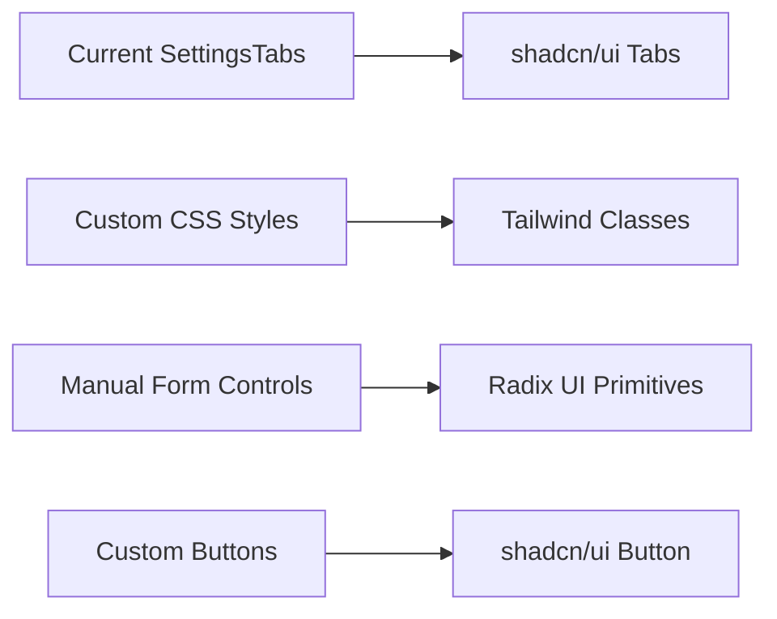
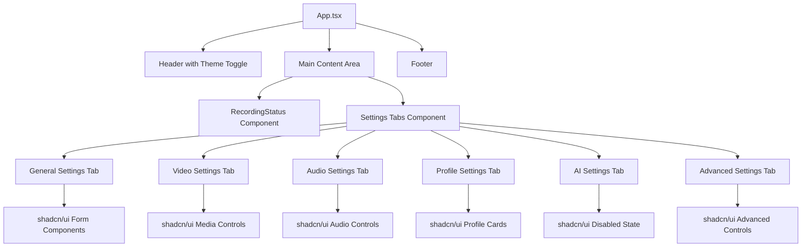

# Shadcn/UI Integration Design Document

## Overview

This document outlines the design for integrating shadcn/ui as the primary UI component library for the Sideo screen recording application. The integration will replace the current custom CSS-based UI with a modern, accessible, and consistent design system built on Radix UI primitives and Tailwind CSS.

## Current State Analysis

### Existing UI Architecture
- **Framework**: React 18.2.0 with TypeScript
- **Styling**: Custom CSS with manual component styling
- **Components**: Basic React components with inline styles and CSS classes
- **Icons**: No standardized icon system
- **Build System**: Vite 4.4.9

### Current Components Structure
```
src/renderer/src/
├── components/
│   ├── tabs/
│   │   ├── AISettings.tsx
│   │   ├── AdvancedSettings.tsx
│   │   ├── AudioSettings.tsx
│   │   ├── GeneralSettings.tsx
│   │   ├── ProfileSettings.tsx
│   │   └── VideoSettings.tsx
│   ├── RecordingStatus.tsx
│   └── SettingsTabs.tsx
├── App.css (252 lines of custom styles)
├── App.tsx
├── index.css
└── main.tsx
```

### Identified Pain Points
- Manual CSS maintenance across components
- Inconsistent styling patterns
- No accessible component primitives
- Limited icon system
- Responsive design challenges
- Custom form controls without accessibility features

## Technology Stack Integration

### Core Dependencies
```json
{
  "dependencies": {
    "class-variance-authority": "^0.7.0",
    "clsx": "^2.0.0",
    "tailwind-merge": "^2.0.0",
    "lucide-react": "^0.400.0",
    "@radix-ui/react-slot": "^1.0.2",
    "@radix-ui/react-label": "^2.0.2",
    "@radix-ui/react-select": "^2.0.0",
    "@radix-ui/react-checkbox": "^1.0.4",
    "@radix-ui/react-switch": "^1.0.3",
    "@radix-ui/react-tabs": "^1.0.4",
    "@radix-ui/react-dialog": "^1.0.5",
    "@radix-ui/react-popover": "^1.0.7",
    "@radix-ui/react-tooltip": "^1.0.7",
    "@radix-ui/react-progress": "^1.0.3"
  },
  "devDependencies": {
    "tailwindcss": "^3.3.0",
    "autoprefixer": "^10.4.16",
    "postcss": "^8.4.31"
  }
}
```

### Configuration Files
- `tailwind.config.js` - Tailwind CSS configuration
- `postcss.config.js` - PostCSS configuration
- `components.json` - Shadcn/ui CLI configuration

## Component Architecture

### UI Component Library Structure
```
src/renderer/src/components/ui/
├── button.tsx
├── input.tsx
├── label.tsx
├── select.tsx
├── checkbox.tsx
├── switch.tsx
├── tabs.tsx
├── dialog.tsx
├── card.tsx
├── badge.tsx
├── progress.tsx
├── tooltip.tsx
├── popover.tsx
├── separator.tsx
└── textarea.tsx
```

### Component Mapping Strategy

#### Settings Tabs Migration


#### Form Controls Upgrade
| Current Component | Shadcn/ui Component | Radix Primitive |
|------------------|-------------------|-----------------|
| HTML `<select>` | Select | @radix-ui/react-select |
| HTML `<input>` | Input | Native with styling |
| HTML `<textarea>` | Textarea | Native with styling |
| Custom checkbox | Checkbox | @radix-ui/react-checkbox |
| Custom toggle | Switch | @radix-ui/react-switch |
| Custom buttons | Button | @radix-ui/react-slot |

### Component Hierarchy Redesign

#### Main Application Structure


## Implementation Strategy

### Phase 1: Foundation Setup (Week 1)
1. **Install and Configure Dependencies**
   ```bash
   npm install tailwindcss postcss autoprefixer
   npx tailwindcss init -p
   npm install class-variance-authority clsx tailwind-merge lucide-react
   ```

2. **Initialize Shadcn/ui**
   ```bash
   npx shadcn@latest init
   ```

3. **Configure Tailwind CSS**
   - Update `tailwind.config.js` with shadcn/ui presets
   - Configure CSS variables for theming
   - Set up content paths for Electron renderer

4. **Update Build Configuration**
   - Modify Vite config for Tailwind CSS processing
   - Ensure PostCSS integration

### Phase 2: Core Components (Week 2)
1. **Install Essential Components**
   ```bash
   npx shadcn@latest add button input label select checkbox switch tabs card
   ```

2. **Create Utility Components**
   - Theme provider component
   - Icon wrapper components
   - Layout components

3. **Migrate Base Components**
   - Update App.tsx to use shadcn/ui components
   - Replace custom buttons with Button component
   - Implement basic layout structure

### Phase 3: Settings Interface (Week 3)
1. **Tabs System Migration**
   - Replace custom tabs with shadcn/ui Tabs
   - Implement tab content components
   - Add proper ARIA labels and accessibility

2. **Form Controls Migration**
   - Replace HTML form controls with shadcn/ui equivalents
   - Implement proper form validation
   - Add loading and error states

3. **Settings Tabs Content**
   - General Settings: Basic form with inputs and selects
   - Video Settings: Device selection and quality controls
   - Audio Settings: Audio device and level controls
   - Profile Settings: Quality profile cards with shadcn/ui Card

### Phase 4: Advanced Features (Week 4)
1. **Dialog and Modal Systems**
   ```bash
   npx shadcn@latest add dialog popover tooltip
   ```

2. **Recording Interface**
   - Progress bar for recording status
   - Control buttons with proper states
   - Status indicators and badges

3. **Theme System**
   - Dark/light mode toggle
   - CSS custom properties for theming
   - Consistent color scheme

## Design System Specifications

### Typography Scale
```css
/* Tailwind Typography Classes */
.text-xs    /* 12px - Supporting text */
.text-sm    /* 14px - Secondary text */
.text-base  /* 16px - Body text */
.text-lg    /* 18px - Prominent text */
.text-xl    /* 20px - Headings */
.text-2xl   /* 24px - Page titles */
```

### Color Palette
```css
/* CSS Custom Properties */
:root {
  --background: 0 0% 100%;
  --foreground: 222.2 84% 4.9%;
  --primary: 222.2 47.4% 11.2%;
  --primary-foreground: 210 40% 98%;
  --secondary: 210 40% 96%;
  --secondary-foreground: 222.2 84% 4.9%;
  --muted: 210 40% 96%;
  --muted-foreground: 215.4 16.3% 46.9%;
  --accent: 210 40% 96%;
  --accent-foreground: 222.2 84% 4.9%;
  --destructive: 0 84.2% 60.2%;
  --destructive-foreground: 210 40% 98%;
  --border: 214.3 31.8% 91.4%;
  --input: 214.3 31.8% 91.4%;
  --ring: 222.2 84% 4.9%;
}

.dark {
  --background: 222.2 84% 4.9%;
  --foreground: 210 40% 98%;
  /* ... dark mode variables */
}
```

### Spacing System
- Consistent spacing using Tailwind's spacing scale
- Container max-widths: `max-w-4xl` for settings
- Padding conventions: `p-6` for cards, `p-4` for forms

### Component Variants
```typescript
// Button variants
const buttonVariants = cva(
  "inline-flex items-center justify-center rounded-md text-sm font-medium",
  {
    variants: {
      variant: {
        default: "bg-primary text-primary-foreground hover:bg-primary/90",
        destructive: "bg-destructive text-destructive-foreground hover:bg-destructive/90",
        outline: "border border-input bg-background hover:bg-accent",
        secondary: "bg-secondary text-secondary-foreground hover:bg-secondary/80",
        ghost: "hover:bg-accent hover:text-accent-foreground",
        link: "text-primary underline-offset-4 hover:underline"
      },
      size: {
        default: "h-10 px-4 py-2",
        sm: "h-9 rounded-md px-3",
        lg: "h-11 rounded-md px-8",
        icon: "h-10 w-10"
      }
    },
    defaultVariants: {
      variant: "default",
      size: "default"
    }
  }
)
```

## Accessibility Enhancements

### Keyboard Navigation
- All interactive elements accessible via keyboard
- Proper tab order throughout the application
- Focus management for modals and dialogs

### Screen Reader Support
- Semantic HTML structure
- ARIA labels and descriptions
- Live regions for dynamic content updates

### Visual Accessibility
- High contrast ratios (WCAG 2.1 AA compliance)
- Focus indicators visible in all themes
- Scalable font sizes

## Migration Guidelines

### Code Migration Pattern
```typescript
// Before: Custom CSS approach
<div className="recording-controls">
  <button className="btn btn-primary" onClick={handleStart}>
    Start Recording
  </button>
</div>

// After: Shadcn/ui approach
<div className="flex gap-4 justify-center">
  <Button onClick={handleStart} className="flex items-center gap-2">
    <PlayIcon className="h-4 w-4" />
    Start Recording
  </Button>
</div>
```

### CSS Class Replacement Strategy
| Old CSS Class | New Tailwind/Shadcn Approach |
|---------------|-------------------------------|
| `.recording-controls` | `flex gap-4 justify-center` |
| `.settings-section` | `<Card className="p-6">` |
| `.device-list` | `<Select>` component |
| `.profile-card` | `<Card>` with hover states |
| `.quality-profiles` | `grid grid-cols-1 md:grid-cols-3 gap-4` |

## Testing Strategy

### Component Testing
- Unit tests for each migrated component
- Visual regression testing with Storybook
- Accessibility testing with axe-core

### Integration Testing
- Settings flow testing
- Theme switching functionality
- Form submission and validation

### Performance Testing
- Bundle size impact analysis
- Runtime performance with large component trees
- Memory usage optimization

## File Organization

### Updated Project Structure
```
src/renderer/src/
├── components/
│   ├── ui/                    # Shadcn/ui components
│   │   ├── button.tsx
│   │   ├── input.tsx
│   │   └── ...
│   ├── layout/                # Layout components
│   │   ├── header.tsx
│   │   ├── sidebar.tsx
│   │   └── theme-provider.tsx
│   ├── forms/                 # Form-specific components
│   │   ├── settings-form.tsx
│   │   └── device-selector.tsx
│   └── recording/             # Recording-specific components
│       ├── status-display.tsx
│       └── control-panel.tsx
├── lib/                       # Utility functions
│   ├── utils.ts              # Shadcn/ui utilities
│   └── constants.ts          # Design system constants
├── styles/
│   └── globals.css           # Global styles with Tailwind
└── hooks/                    # Custom React hooks
    ├── use-theme.ts
    └── use-settings.ts
```

## Risk Mitigation

### Bundle Size Management
- Tree-shake unused Radix UI components
- Use dynamic imports for heavy components
- Monitor bundle size impact with tools

### Compatibility Considerations
- Electron renderer process compatibility
- Node.js integration requirements
- Windows 11 specific styling needs

### Fallback Strategies
- Progressive migration approach
- Maintain CSS fallbacks during transition
- Component-level feature flags for rollback

## Success Metrics

### Technical Metrics
- Bundle size reduction: Target < 50KB increase
- Component test coverage: > 90%
- Accessibility score: WCAG 2.1 AA compliance
- Performance: < 100ms component render time

### User Experience Metrics
- Consistent visual design across all components
- Improved keyboard navigation
- Enhanced screen reader compatibility
- Responsive design on various screen sizes

### Developer Experience Metrics
- Reduced CSS maintenance burden
- Faster component development
- Improved component reusability
- Better TypeScript integration